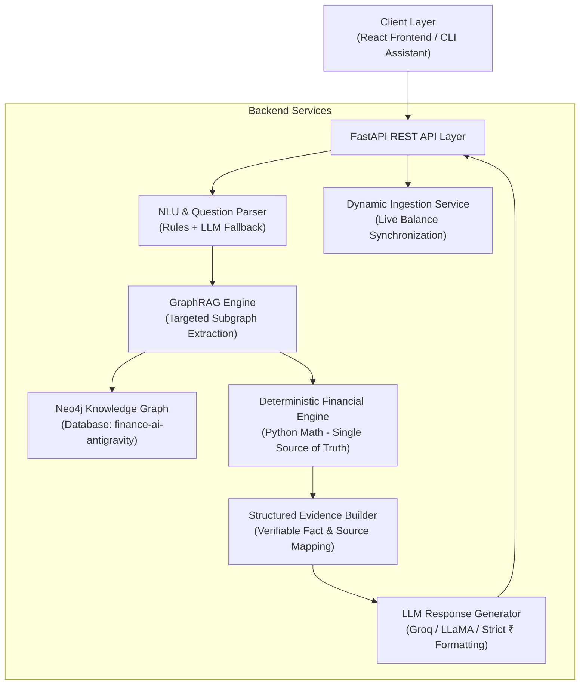

# System Architecture: Personal Finance AI Assistant

## 1. Architectural Overview

---

## 2. Component Design & Responsibilities

### 1. Data Layer (Neo4j)
- **Database**: `finance-ai-antigravity`
- Stores entities as graph nodes: `User`, `Account`, `Transaction`, `Category`, `Income`, `Loan`, `EMI`, `Goal`, `Budget`.
- Graph relationships represent explicit financial connections (`MADE_TRANSACTION`, `BELONGS_TO`, `HAS_EMI`, `HAS_GOAL`).

### 2. Deterministic Financial Engine (`financial_engine.py`)
- Single source of truth for all mathematical logic:
  - **Savings Rate**: $\frac{\text{Total Income} - \text{Total Expenses}}{\text{Total Income}} \times 100$
  - **Emergency Fund Target**: $\text{Monthly Expenses} \times 3$
  - **Emergency Runway**: $\frac{\text{Current Balance}}{\text{Monthly Expenses}}$
  - **Debt Burden (DTI)**: $\frac{\text{Monthly Pending EMI}}{\text{Total Monthly Income}} \times 100$
  - **Purchase Affordability**: Multi-factor balance check against emergency reserve requirements.

### 3. GraphRAG Retrieval Engine (`graph_rag.py`)
- Analyzes question intent and selectively traverses targeted subgraphs rather than dumping entire databases into prompt context.

### 4. Grounded Explanation Engine (`response_generator.py`)
- Generates natural language explanations using strict prompt constraints ensuring zero arithmetic hallucination and complete preservation of Indian Rupee (`₹`) symbols.

### 5. Full-Stack Layer
- **Backend**: FastAPI with async route handlers, CORS middleware, and Pydantic validation.
- **Frontend**: React + Vite dashboard with KPI cards, Recharts visualizations, dynamic transaction table, and conversational AI chat.
