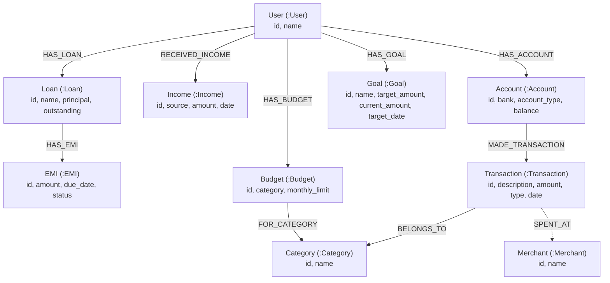

# Knowledge Graph Schema: Personal Finance AI

This document specifies the complete node labels, property schemas, and relationship semantics of the **Personal Finance AI** knowledge graph hosted in Neo4j.

---

## 1. Schema Diagram

---

## 2. Entity Specifications

### `(:User)`
Represents an individual user profile.
- **Properties**:
  - `id` (String, Unique): e.g. `"U001"`
  - `name` (String): e.g. `"Rahul"`

### `(:Account)`
Represents a bank account or liquid wallet.
- **Properties**:
  - `id` (String, Unique): e.g. `"A001"`
  - `bank` (String): e.g. `"Demo Bank"`
  - `account_type` (String): `"Savings"` | `"Current"`
  - `balance` (Float): e.g. `45000.0`

### `(:Transaction)`
Represents an atomic financial debit or credit transaction.
- **Properties**:
  - `id` (String, Unique): e.g. `"T_1A2B3C4D"`
  - `description` (String): e.g. `"Grocery Shopping"`
  - `amount` (Float): e.g. `4000.0`
  - `type` (String): `"EXPENSE"` | `"INCOME"`
  - `date` (Date): e.g. `date('2026-09-07')`

### `(:Category)`
Represents spending categorization for financial analytics.
- **Properties**:
  - `id` (String, Unique): e.g. `"C001"`
  - `name` (String, Unique): e.g. `"Food"`, `"Housing"`, `"Transport"`, `"Utilities"`

### `(:Income)`
Represents recurring or one-time income streams.
- **Properties**:
  - `id` (String, Unique): e.g. `"I001"`
  - `source` (String): e.g. `"Salary"`, `"Freelance"`
  - `amount` (Float): e.g. `60000.0`
  - `date` (Date): e.g. `date('2026-09-01')`

### `(:Loan)`
Represents outstanding credit liabilities.
- **Properties**:
  - `id` (String, Unique): e.g. `"L001"`
  - `name` (String): e.g. `"Personal Loan"`
  - `principal` (Float): e.g. `200000.0`
  - `outstanding` (Float): e.g. `150000.0`

### `(:EMI)`
Represents individual periodic repayment obligations attached to a loan.
- **Properties**:
  - `id` (String, Unique): e.g. `"E001"`
  - `amount` (Float): e.g. `10000.0`
  - `due_date` (Date): e.g. `date('2026-09-10')`
  - `status` (String): `"PENDING"` | `"PAID"`

### `(:Goal)`
Represents savings targets such as an emergency fund or milestone goals.
- **Properties**:
  - `id` (String, Unique): e.g. `"G001"`
  - `name` (String): e.g. `"Emergency Fund"`
  - `target_amount` (Float): e.g. `100000.0`
  - `current_amount` (Float): e.g. `30000.0`
  - `target_date` (Date): e.g. `date('2027-03-01')`

### `(:Budget)`
Represents monthly spending thresholds allocated per category.
- **Properties**:
  - `id` (String, Unique): e.g. `"B001"`
  - `category` (String): e.g. `"Food"`
  - `monthly_limit` (Float): e.g. `8000.0`

---

## 3. Relationships

| Relationship | Start Node | End Node | Semantics |
| :--- | :--- | :--- | :--- |
| `HAS_ACCOUNT` | `User` | `Account` | Connects user to owned bank accounts. |
| `MADE_TRANSACTION` | `Account` | `Transaction` | Captures financial ledger debits/credits. |
| `BELONGS_TO` | `Transaction` | `Category` | Categorizes transactions for spending analytics. |
| `RECEIVED_INCOME` | `User` | `Income` | Records earnings. |
| `HAS_LOAN` | `User` | `Loan` | Connects user to debt liabilities. |
| `HAS_EMI` | `Loan` | `EMI` | Maps loan installment schedule. |
| `HAS_GOAL` | `User` | `Goal` | Tracks savings milestones. |
| `HAS_BUDGET` | `User` | `Budget` | Sets category limits. |
| `FOR_CATEGORY` | `Budget` | `Category` | Binds monthly limit to a specific category. |
