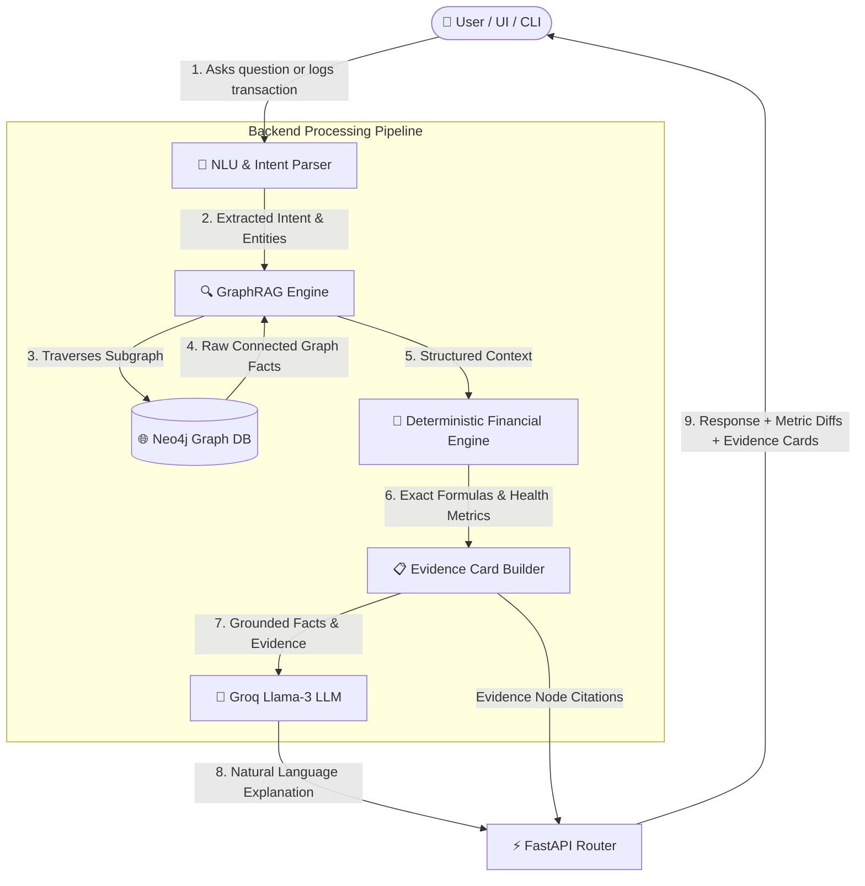

# Personal Finance AI Assistant: Complete Working Guide & System Documentation

An end-to-end technical explanation of how the **Personal Finance AI Assistant** works, combining **Dynamic Knowledge Graphs (Neo4j)**, **Deterministic Financial Reasoning (Python)**, **GraphRAG Subgraph Traversal**, and **Grounded LLM Explanations (Groq)** with a modern **React Dashboard** and **FastAPI Backend**.

---

## 1. Executive Summary & Core Philosophy

Traditional LLM chatbots frequently hallucinate arithmetic, miscalculate financial runway, or provide generic advice disconnected from a user's real balance sheet. Relational SQL databases struggle with multi-hop financial dependencies (e.g., how an EMI payment cascades to monthly savings, emergency runway, and discretionary purchase affordability).

This project solves both problems by enforcing a strict **tri-layer separation of concerns**:

```
+-------------------------------------------------------------------------------+
| 1. TRUTH & DEPENDENCY LAYER (Neo4j Knowledge Graph)                           |
|    Stores entities (Users, Accounts, Transactions, Loans, Goals) as nodes      |
|    and financial connections as directed relationships.                       |
+-------------------------------------------------------------------------------+
                                      |
                                      v
+-------------------------------------------------------------------------------+
| 2. DETERMINISTIC CALCULATION LAYER (Python Financial Engine)                 |
|    Calculates exact mathematical formulas (Savings Rate, Health Score,        |
|    Runway, DTI, Affordability). Zero LLM math hallucination.                  |
+-------------------------------------------------------------------------------+
                                      |
                                      v
+-------------------------------------------------------------------------------+
| 3. GROUNDED SYNTHESIS & PRESENTATION LAYER (GraphRAG + Groq LLM + React UI)   |
|    LLM receives pre-calculated facts and evidence cards. Its sole role is to  |
|    explain findings clearly in natural language, preserving ₹ currency.       |
+-------------------------------------------------------------------------------+
```

---

## 2. End-to-End System Architecture



---

## 3. The 5 Core Subsystems & How They Work

### Layer 1: The Dynamic Knowledge Graph (Neo4j)

The graph database represents the user's complete financial life as an interconnected network of nodes and relationships:

* **Node Types**:
  * `User`: Root profile (`id`, `name`, `monthly_income`).
  * `Account`: Bank/wallet balance (`id`, `name`, `type`, `balance`).
  * `Income`: Verified salary and earnings streams (`id`, `source`, `amount`, `frequency`).
  * `Category`: Expense taxonomy (`id`, `name`).
  * `Transaction`: Individual expenses (`id`, `amount`, `date`, `description`).
  * `Loan` & `EMI`: Active liabilities and monthly obligations (`id`, `total_amount`, `monthly_emi`).
  * `Goal`: Target milestones (e.g., `Emergency Fund`, `Home Down Payment`).
  * `Budget`: Spending constraints per category.

* **Relationships**:
  * `(:User)-[:OWNS]->(:Account)`
  * `(:User)-[:EARNS]->(:Income)`
  * `(:User)-[:MADE_TRANSACTION]->(:Transaction)-[:BELONGS_TO]->(:Category)`
  * `(:User)-[:HAS_LOAN]->(:Loan)-[:HAS_EMI]->(:EMI)`
  * `(:User)-[:PURSUING_GOAL]->(:Goal)`
  * `(:User)-[:HAS_BUDGET]->(:Budget)-[:APPLIES_TO]->(:Category)`

> **Why a Graph?** When evaluating a purchase, the system does not just query a single table; it traverses from the `User` to their `Account` balance, through their active `EMI` commitments, across historical `Transaction` averages, directly to their `Goal` buffer in one sub-millisecond graph traversal.

---

### Layer 2: The Deterministic Financial Reasoning Engine (`financial_engine.py`)

The LLM is **never** permitted to calculate sums, percentages, or ratios. All calculations are executed deterministically in pure Python:

1. **Savings Rate**:
   $$\text{Savings Rate} = \frac{\text{Total Income} - \text{Total Expenses}}{\text{Total Income}} \times 100$$
   *Example: $\frac{₹60,000 - ₹21,000}{₹60,000} \times 100 = 65.0\%$*

2. **Emergency Fund Target & Runway**:
   $$\text{Recommended Emergency Buffer} = \text{Monthly Expenses} \times 3$$
   $$\text{Runway (Months)} = \frac{\text{Liquid Bank Balance}}{\text{Monthly Expenses}}$$
   *Example: $\frac{₹45,000}{₹21,000} = 2.14\text{ months}$*

3. **Debt-to-Income Burden (DTI)**:
   $$\text{DTI} = \frac{\text{Monthly Pending EMI}}{\text{Total Monthly Income}} \times 100$$
   *Example: $\frac{₹10,000}{₹60,000} \times 100 = 16.67\%$ (Safe $< 35\%$)*

4. **Deterministic Financial Health Score (0–100 & Grade)**:
   * **Savings Score (30 pts)**: Scaled against target $\ge 20\%$ savings rate.
   * **Emergency Fund Score (30 pts)**: Scaled against 3–6 months expense buffer.
   * **Debt Burden Score (25 pts)**: Penalized if DTI $> 35\%$.
   * **Budget Discipline Score (15 pts)**: Evaluated against category budget overspends.
   * *Overall Grade Scale*: `A+` ($\ge 90$), `A` ($\ge 80$), `B` ($\ge 70$), `C` ($\ge 60$), `D` ($< 60$).

5. **Purchase Affordability Simulator**:
   Simulates the exact before-and-after impact of a discretionary purchase:
   * Current Balance vs. Post-Purchase Balance
   * Current Runway vs. Post-Purchase Runway
   * Impact on Emergency Fund Shortfall
   * Deterministic Verdict: `Affordable`, `Caution`, or `Unsafe`.

---

### Layer 3: Natural Language Understanding (NLU) & Intent Parser (`question_parser.py`)

When a user speaks or types naturally, the NLU engine identifies their financial intent and extracts necessary parameters:

* **Supported Intents**:
  * `affordability`: "Can I buy a ₹15,000 smartphone?"
  * `health_score`: "What is my financial health score?"
  * `emergency_fund`: "How much emergency fund do I have?"
  * `spending_analysis`: "Where did I spend my money this month?"
  * `debt_status`: "What are my outstanding loans and EMIs?"
  * `income_status`: "What is my monthly salary?"
  * `add_transaction`: "I just spent ₹2,500 on groceries."
* **Entity Extraction**: Automatically extracts currency values (`₹15,000`, `15k`), category names (`Groceries`, `Electronics`), and timeframes.

---

### Layer 4: GraphRAG Subgraph Traversal & Evidence Cards (`graph_rag.py`)

Instead of standard vector similarity search over unverified text chunks, **GraphRAG** performs structural graph traversals:

1. Identifies the user node (`User {id: "U001"}`).
2. Traverses all relevant subgraphs:
   ```cypher
   MATCH (u:User {id: $user_id})-[:OWNS]->(a:Account)
   OPTIONAL MATCH (u)-[:EARNS]->(i:Income)
   OPTIONAL MATCH (u)-[:MADE_TRANSACTION]->(t:Transaction)-[:BELONGS_TO]->(c:Category)
   OPTIONAL MATCH (u)-[:HAS_LOAN]->(l:Loan)-[:HAS_EMI]->(e:EMI)
   OPTIONAL MATCH (u)-[:PURSUING_GOAL]->(g:Goal)
   RETURN a, i, t, c, l, e, g
   ```
3. Constructs **Verifiable Evidence Cards** with explicit node IDs and amounts:
   * `[Node: Account/A001]` Current Balance = ₹45,000
   * `[Node: Income/I001]` Monthly Salary = ₹60,000
   * `[Node: EMI/E001]` Personal Loan EMI = ₹10,000
   * `[Node: Goal/G001]` Emergency Fund Target = ₹1,00,000 (Current: ₹30,000)

---

### Layer 5: Grounded LLM Generation (`llm_service.py` & `prompt_builder.py`)

The prompt sent to Groq's Llama-3 follows a strict **3-Tier Context Architecture**:

1. **Tier 1 (Absolute Truth)**: Grounded Graph Facts and node citations.
2. **Tier 2 (Pre-Computed Math)**: The exact numbers computed by the Python Financial Engine.
3. **Tier 3 (Style & Constraints)**:
   * Always retain the Indian Rupee symbol (`₹`) — never convert to USD/`$`.
   * Only explain and advise based on the pre-computed metrics.
   * Cite evidence nodes for full transparency.

---

## 4. Step-by-Step Execution Scenarios

### Scenario A: Asking "Can I afford to buy a ₹15,000 smartphone?"

```
1. User Query: "Can I afford to buy a ₹15,000 phone?"
       │
2. NLU Parser identifies:
       Intent = 'affordability'
       Item Amount = ₹15,000
       Category = 'Electronics'
       │
3. GraphRAG queries Neo4j for User U001:
       Current Balance: ₹45,000
       Monthly Expenses: ₹21,000
       Monthly Income: ₹60,000
       Emergency Fund: ₹30,000
       │
4. Python Financial Engine executes Affordability Simulation:
       New Balance = ₹45,000 - ₹15,000 = ₹30,000
       Current Runway = 2.14 months (₹45,000 / ₹21,000)
       Post-Purchase Runway = 1.43 months (₹30,000 / ₹21,000)
       Threshold = 2.0 months minimum buffer
       Verdict = "CAUTION" (Runway drops below recommended 2-month threshold)
       │
5. LLM generates grounded explanation:
       "You currently have ₹45,000 in your account. While you have enough cash to pay ₹15,000, 
       this purchase will reduce your emergency runway from 2.14 months down to 1.43 months 
       (leaving ₹30,000). Since this is below the recommended 2-month buffer, it is advised 
       to build your emergency reserve to at least ₹63,000 before making this purchase."
       │
6. UI renders natural response + Collapsible Evidence Card with exact math breakdown.
```

---

### Scenario B: Adding a Transaction: "Spent ₹2,500 on groceries"

```
1. User logs: "Spent ₹2,500 on groceries"
       │
2. Ingestion Service executes atomic Cypher in Neo4j:
       - Creates new Transaction node (:Transaction {id: "TXN_...", amount: 2500, description: "Groceries"})
       - Links to (:Category {name: "Food"})
       - Subtracts ₹2,500 from (:Account {id: "A001"}) balance: ₹45,000 -> ₹42,500
       │
3. Real-Time Recalculation Triggered:
       - New Monthly Expenses: ₹21,000 + ₹2,500 = ₹23,500
       - New Savings Rate: (₹60,000 - ₹23,500) / ₹60,000 = 60.83%
       - New Emergency Runway: ₹42,500 / ₹23,500 = 1.81 months
       │
4. REST API returns updated financial state to React UI.
5. React Dashboard dynamically re-renders KPI cards and expense breakdown pie chart instantly.
```

---

## 5. Directory Structure & Key Files

```
Personal_Finance_AI_Antigravity/
├── backend/
│   ├── app/
│   │   ├── database/
│   │   │   └── neo4j_service.py       # Parameterized Cypher CRUD & Schema management
│   │   ├── engine/
│   │   │   └── financial_engine.py   # Deterministic mathematical formulas & health score
│   │   ├── nlu/
│   │   │   ├── question_parser.py    # Multi-entity intent extraction
│   │   │   └── transaction_extractor.py # Natural language transaction parser
│   │   ├── rag/
│   │   │   └── graph_rag.py          # Multi-hop subgraph traversals & Evidence builder
│   │   ├── services/
│   │   │   ├── ingestion_service.py  # Dynamic transaction ingestion & balance sync
│   │   │   ├── llm_service.py        # Groq API integration & response synthesis
│   │   │   ├── prompt_builder.py     # 3-Tier grounded prompt architecture
│   │   │   └── response_generator.py # Unified orchestrator
│   │   └── routers/
│   │       ├── assistant.py          # /api/assistant/chat & /query endpoints
│   │       ├── finance.py            # /api/finance/health & /metrics endpoints
│   │       ├── goals.py              # /api/goals endpoints
│   │       └── transactions.py       # /api/transactions/add & /recent endpoints
│   ├── cli/
│   │   └── assistant.py              # Interactive terminal CLI assistant
│   ├── scripts/
│   │   └── seed_db.py                # Database seeder with sample profile (Rahul U001)
│   └── tests/
│       ├── verify_environment.py     # Baseline formulas & environment tests
│       ├── test_dynamic_graph.py     # Dynamic CRUD & balance sync verification
│       ├── test_api.py               # FastAPI REST endpoint integration tests
│       └── test_evaluation_benchmark.py # 10-query research benchmark
├── frontend/
│   ├── src/
│   │   ├── components/
│   │   │   ├── ChatInterface.jsx     # AI Chat with collapsible Evidence Cards
│   │   │   ├── HealthScoreCard.jsx   # Interactive financial score meter & grade
│   │   │   ├── MetricCards.jsx       # Real-time KPI stat cards
│   │   │   ├── TransactionForm.jsx   # Live transaction logger
│   │   │   └── Visualizations.jsx    # Recharts expense breakdown & monthly cashflow
│   │   ├── App.jsx                   # Main React Dashboard layout
│   │   └── index.css                 # Dark glassmorphism styling
│   └── package.json
├── docs/
│   ├── HOW_IT_WORKS.md               # (This Master Document)
│   ├── ARCHITECTURE.md               # Component architecture & diagrams
│   ├── GRAPH_SCHEMA.md               # Neo4j node types & relationship specs
│   ├── API_DOCUMENTATION.md          # REST API reference
│   ├── EVALUATION.md                 # Vector RAG vs. GraphRAG benchmark
│   └── DEVELOPMENT_LOG.md            # Phase 0-16 execution milestones
├── run_cli.py                        # Root launcher for CLI assistant
├── run_tests.py                      # Root launcher for all test suites
├── requirements.txt                  # Python dependencies
└── .env                              # Environment variables (Neo4j & Groq credentials)
```

---

## 6. How to Run and Interact With the Project

### 1. Start the FastAPI Backend
```powershell
& ".\.venv\Scripts\python.exe" -m uvicorn backend.main:app --reload --port 8000
```
* **Swagger Interactive Docs**: [http://127.0.0.1:8000/docs](http://127.0.0.1:8000/docs)

### 2. Start the React Frontend Dashboard
```powershell
cd frontend
npm run dev
```
* **Web Dashboard**: [http://localhost:3000](http://localhost:3000)

### 3. Run the Terminal CLI Assistant
```powershell
& ".\.venv\Scripts\python.exe" run_cli.py
```

### 4. Run the Full Test Suite & Benchmark
```powershell
& ".\.venv\Scripts\python.exe" run_tests.py
```

### 5. Inspect the Database in Neo4j Browser
1. Open **[http://localhost:7474](http://localhost:7474)** in your web browser.
2. Select database: `finance-ai-antigravity`.
3. Run the Cypher query to see all nodes and connections:
   ```cypher
   MATCH (n) RETURN n;
   ```
